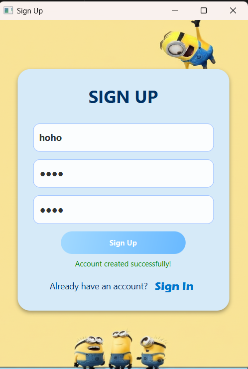
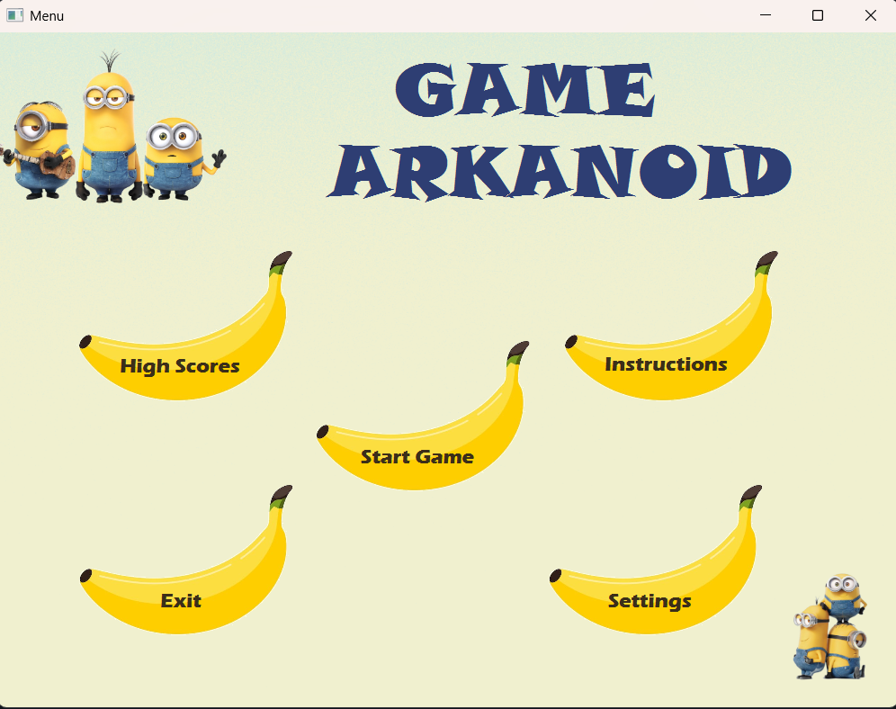
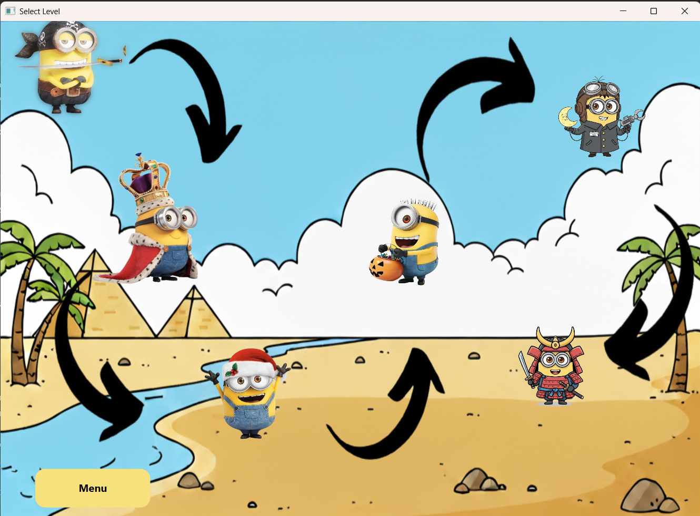
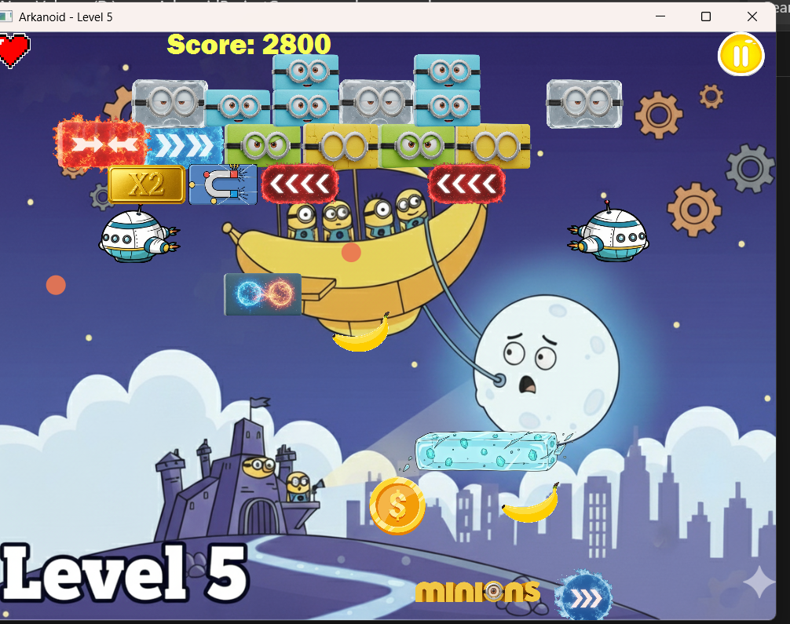
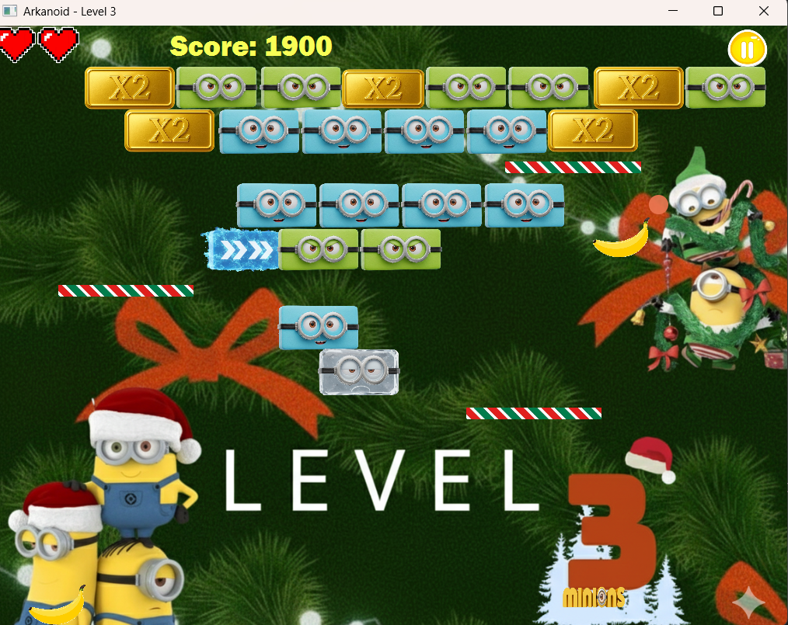
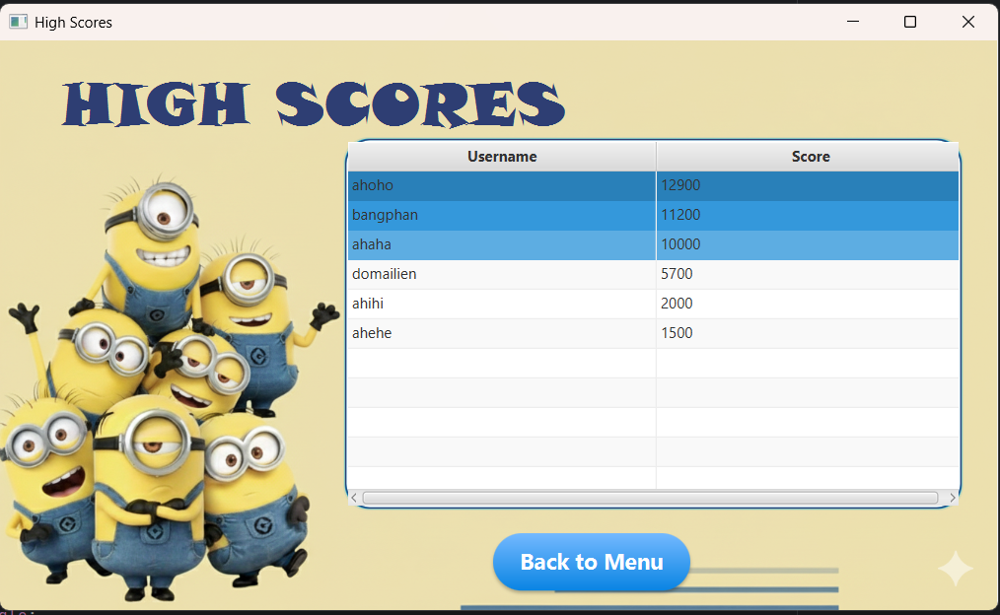

# Arkanoid Game – Object-Oriented Programming Project

## Author
**Group:** CODE & PRAY  
**Class:** INT2204_6  

1. Phan Doãn Thanh Bằng – 24021384  
2. Đỗ Mai Liên          – 24022677  

**Instructor:**  
1. Giảng viên lý thuyết: TS. Tô Văn Khánh  
2. Giảng viên thực hành: Trương Xuân Hiếu  
3. Giảng viên thực hành: Kiều Văn Tuyên  

**Semester:** HK1 – Năm học: 2025 – 2026

  ---

## Description
Đây là một trò chơi Arkanoid kinh điển được phát triển bằng Java, một dự án/bài tập lớn của khóa học Lập trình Hướng Đối tượng. Dự án này trình bày việc triển khai `**OOP principles**` và `**design patterns**`

---
## UML Diagram
### Class Diagram
**Entity**

**Level**

**Menu**

---

### Key features:
1. Trò chơi được phát triển bằng **Java 21+** với **JavaFX/Swing** cho GUI và **SCENEBUILDER** 
2. Triển khai các nguyên tắc OOP cốt lõi: `*Đóng gói, Kế thừa, Đa hình và Trừu tượng.*`  
3. Áp dụng nhiều mẫu thiết kế: `*Singleton Pattern, Singleton Pattern, Template Method Pattern,..*`
4. Xây dựng giao diện menu tương tác với người dùng: `*START GAME, EXIT, INSTRUCTIONS, SETTINGS, HIGHSCORES.*`
5. Xây dựng hệ thống tài khoản: `**SignIn**, **SignUp**` và tính năng `*Remember password, Show Password, Forgot password.*`
6. Hỗ trợ `**leaderboard system**` và lưu kết quả khi chơi
7. Bao gồm: **sound effects, animations** và **power-up systems** 
8. Tính năng **multithreading** cho trải nghiệm chơi mượt mà và giao diện người dùng phản hồi nhanh  

### Game mechanics:
- Điều khiển thanh `**paddle**` để bóng nảy và phá hủy các viên gạch
- Thu thập `**bananas**` để được cộng điểm 
- Thu thập `**power-ups**` để tăng sức mạnh cho các khả năng đặc biệt  
- Vượt qua nhiều cấp độ khác nhau và độ khó tăng dần qua các Level 
- Ghi điểm và cạnh tranh trên bảng xếp hạng

---

## Design Patterns Implementation

### 1. Singleton Pattern
**Được sử dụng ở:** `SoundManager` – lớp quản lý âm thanh toàn cục, cùng các thực thể âm thanh tĩnh như `menuMusicPlayer`, `gameMusicPlayer`.

**Mục đích:**  
Đảm bảo chỉ có **một thể hiện duy nhất** của trình quản lý âm thanh trong toàn bộ chương trình.  

**Điều này giúp:**
- Tránh xung đột hoặc phát trùng lặp nhạc nền.  
- Dễ dàng truy cập và điều chỉnh âm lượng từ bất kỳ lớp nào (như `SettingsController`, `MapController`, ...).

---

### 2.  Template Method Pattern
**Được sử dụng ở:** `BaseGameController` (lớp cha) và các lớp con như `Level1Controller`, `Level2Controller`, ...  

**Mục đích:**
- `BaseGameController` định nghĩa thuật toán tổng quát cho vòng lặp game (game loop):
  - Cập nhật trạng thái game  
  - Di chuyển paddle và ball  
  - Xử lý va chạm cơ bản  
  - Tải dữ liệu bricks mặc định  
- Các lớp con ghi đè các bước cụ thể (template hooks), ví dụ:
  - `onBrickHit(Brick brick, Ball ball)` để thêm hiệu ứng riêng khi gạch bị phá.  
  - `initLevel()` để định nghĩa bố cục, số lượng và loại gạch riêng cho từng màn.  

**Lợi ích:**  
Giúp tái sử dụng logic chung mà vẫn cho phép tùy biến hành vi riêng của từng màn chơi, **tránh lặp code** và **dễ mở rộng** khi thêm level mới.

---

### 3.  Factory Method Pattern
**Được sử dụng ở:**
- Khai báo trừu tượng trong `BaseGameController.java`  
- Cài đặt cụ thể trong các lớp con: `Level1Controller.java`, `Level2Controller.java`, `Level3Controller.java`, ...  

**Mục đích:**  
Cung cấp **cơ chế tạo đối tượng linh hoạt** (ở đây là các loại `Brick`) mà không cần biết chính xác lớp con nào sẽ được tạo.  

- `BaseGameController` chỉ biết cần “tạo một viên gạch”, nhưng không biết đó là loại nào (ví dụ: `NormalBrick`, `StrongBrick`, `ShrinkBrick`, …).  
- Mỗi lớp level tự định nghĩa cách tạo gạch của riêng mình thông qua phương thức `createBrick()`.  

**Lợi ích:**
- Khi thêm một level mới, chỉ cần viết lớp mới kế thừa `BaseGameController` và định nghĩa lại `createBrick()`.

---

## Multithreading Implementation

### Game Loop Thread và Rendering Thread

**Sử dụng như thế nào:**  
Toàn bộ vòng lặp game được quản lý bởi một đối tượng `AnimationTimer` trong `BaseGameController.java`.

**Mục đích:**  
`AnimationTimer` là công cụ đa luồng chuyên dụng của JavaFX. Nó chạy trên một luồng đặc biệt gọi là **JavaFX Application Thread**, chịu trách nhiệm cho cả hai việc:

- **Cập nhật logic:** Gọi hàm `update()` khoảng 60 lần/giây để di chuyển bóng, paddle, và xử lý va chạm.  
- **Vẽ đồ họa (Rendering):** Sau khi `update()` chạy xong, luồng này cũng đảm nhiệm việc vẽ lại vị trí mới của các đối tượng (`paddleRect`, `ballCircle`, …) lên màn hình.  

Bằng cách sử dụng `AnimationTimer`, logic game và việc cập nhật giao diện được đồng bộ, đảm bảo game vận hành ổn định và phản hồi kịp thời.

---

### I/O Thread 

**Sử dụng như thế nào:**  
Bạn đã sử dụng một `Task<Boolean>` trong `GameOverController.java` khi màn hình kết thúc game hiện lên.

**Mục đích:**  
Việc đọc và ghi file điểm cao (`highscores.txt`) là một tác vụ nặng (I/O).  
Bằng cách chạy tác vụ này trên một luồng riêng (`new Thread(task).start()`), màn hình “Game Over” có thể hiển thị ngay lập tức mà không bị treo trong khi xử lý file.  

Sau đó, `setOnSucceeded` được dùng để cập nhật kết quả (“Điểm cao mới!”) lên giao diện một cách an toàn.

---

## Usage

### Controls

| Key | Action |
|-----|---------|
| **←** or **A** | Move paddle left |
| **→** or **D** | Move paddle right |
| **SPACE** | Launch ball |
### Alternatively: sử dụng `**con trỏ chuột**` để Click vào các nút trên màn hình ( *ví dụ: nút Home, nút Exit,...* )
### How To Play
1. **Sign Up / Sign In:** Đăng nhập tài khoản ( `*user*, *password*` )
         ( nếu chưa có tài khoản thì `*SIGN UP*` )
2. **Menu:** click vào nút **banana** cần chọn, có 5 nút: *START GAME, EXIT, INSTRUCTIONS, SETTINGS, HIGHSCORES.*
3. **Start the game:** Click `"Start Game"` from the main menu.
4. **Map:** Lựa chọn Level muốn chơi trong 6 Level
5. **Control the paddle:** Sử dụng `**←/→** OR **A/D**` để di chuyển thanh Paddle qua lại hứng bóng
6. **Launch the ball:** Sử dụng phím `**SPACE**` để bóng bắt đầu di chuyển
7. **Destroy bricks:** Di chuyển bóng sao cho phá vỡ hết gạch  
8. **Collect power-ups:** Sử dụng bóng để phá vỡ các viên gạch có `**POWERUP**` và dùng Paddle hứng chúng -> tăng sức mạnh để có khả năng đặc biệt -> dễ dàng qua Level  
9. **Avoid losing the ball:** giữ bóng không bị rơi khỏi Paddle, mỗi Level sẽ có 3 mạng để vượt qua Game 
10. **Complete the level:** Phá hủy tất cả các gạch, thu thập được nhiều `**banana**`
    
## Power-ups

| Symbolic Icon | Name | Effect |
|------|------|--------|
| 🟦 | **Expand Paddle** | Tăng kích thước Paddle trong 5 giây |
| 🟥 | **Shrink Paddle** | giảm kích thước Paddle trong 5 giây |
| ⚡ | **Fast Ball** | Tăng tốc độ bóng trong 2 giây |
| 🐌 | **Slow Ball** | Giamr tốc độ bóng |
| 🔵🔵 | **Multi Ball** | Spawns 2 additional balls |
| 🍌🍌 | **Double_score** | Nhân đôi điểm |
| 🧲 | **Magnet** | Bóng dính vào Paddle, ấn SPACE để tiếp tục chơi |
| 💣 | **Boom** | Phá hủy gạch xung quanh |
| ❄️ | **Paddle change** | Thay đổi màu sắc cảu Paddle |
## Scoring System: Score: 1000 điểm

- Đập vỡ `**Brick**` thì `**banana** rơi xuống
- `1 banana = +100 điểm`
- Powerup DOUBLE_SCORE : điểm hiện tại nhân đôi
  
---

## Demo

### Screenshots

**Sign In**

**SignUp**

**Menu**

**Map**

**Gameplay**

**PowerUp**

**Highscores**

### Video Demo

---

## Future Improvements
### Planned Features
1. Chế độ chơi bổ sung
- Chế độ 2 người chơi cùng lúc
- Chế độ chơi trong thời gian
- Thêm nhiều level, thêm các quái vật,...
2. Lối chơi nâng cao
- Nâng cấp nhiều loại powerup hại và giúp ích
- trận chiến với **BOSS**
3. Cải tiến kĩ thuật
- Lưu tải game
- Thêm hiệu ứng hạt và đồ họa nâng cao hơn
- Nâng cấp sang chế độ đối thủ AI
- Thêm bảng xếp hạng trực tuyến

---

## Technologies Used

| Technology | Version | Purpose |
|-------------|----------|----------|
| **Java** | 21 | Core language |
| **JavaFX** | 21.0.6 | GUI framework |
| **FXGL** | 17.3 | Game engine |
| **Maven** | 3.13.0 | Build & dependency management |
| **JUnit 5** | 5.12.1 | Unit testing framework |

---

## License

Dự án Game này được phát triển chỉ nhằm mục đích `giáo dục` 

**Academic Integrity:** Mã này được cung cấp để tham khảo. vui lòng tuân thủ chính sách chính trực học thuật của trường bạn

---

## Notes

- Game được phát triển như một phần của chương trình giảng dạy *Object-Oriented Programming with Java* 
- Tất cả code đều được các thành viên trong nhóm viết dưới sự hướng dẫn cảu các Giảng viên giảng dạy
- Hình ảnh, âm thanh,... có thể được sử dụng cho mục đích giáo dục theo luật sử dụng hợp lý
- Dự án Game chứng minh ứng dụng thực tế của các khái niệm OOP và mẫu thiết kế  

---

*Last updated: [Ngày/Tháng/Năm]*

